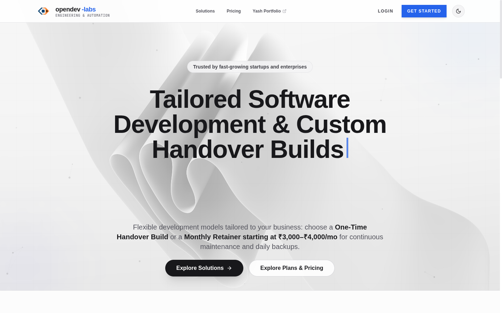
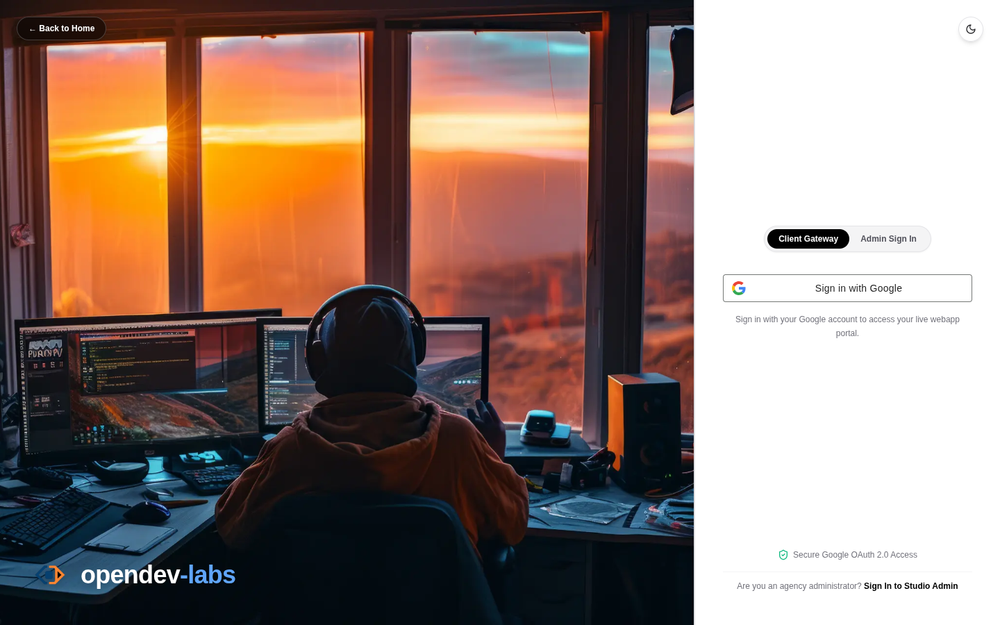
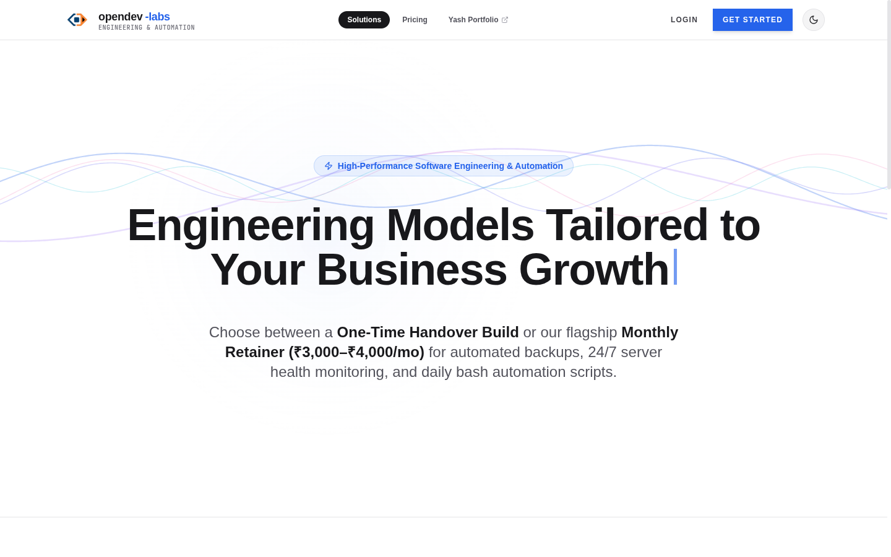
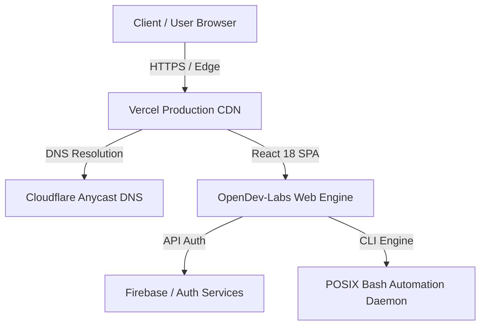

  # ⚡ OpenDev-Labs
  ### Enterprise Software Engineering, AI Systems & Automation Studio

  
  
  
  
  
  

   

  

   
   

  [🌐 Live Platform](https://www.opendev-labs.com) • 
  [🚀 Latest Release (v1.0.0)](https://github.com/opendev-labs/opendev-labs/releases/tag/v1.0.0) • 
  [👨‍💻 Founder Portfolio](https://www.opendev-labs.com/iamyashramteke/) • 
  [📄 Documentation](#-platform-features)

---

## 📖 Overview

**OpenDev-Labs** is an advanced software engineering and Linux automation platform founded and led by **Yash Shirish Ramteke** ([@iamyash.io](https://www.opendev-labs.com/iamyashramteke/)).

We build high-performance web applications, AI-assisted development hubs, automated retainer dashboards, and self-healing POSIX Bash infrastructure pipelines for modern enterprises and fast-scaling startups.

---

## 📷 Platform Visual Showcase

### 1. Main Application & Dynamic Hero Studio
The core landing engine features dynamic typewriter intent prediction, ambient canvas particles, and instant solution browsing.

---

### 2. Developer Studio & Secure Client Portal Authentication
Unified role-based authentication allowing developers to manage active builds and clients to inspect project milestones and financial receipts.

---

### 3. Software Solutions & Retainer Management
Transparent delivery models offering one-time handover builds alongside managed monthly maintenance retainers.

---

## 🏷️ Latest Release: `v1.0.0`

We are excited to announce **[Release v1.0.0](https://github.com/opendev-labs/opendev-labs/releases/tag/v1.0.0)** — *Production Launch & Client Portal Hub*.

### 📦 Key Features in `v1.0.0`:
- 🚀 **Full React 18 + Vite Production Architecture**: High-speed client-side rendering with TailwindCSS & Framer Motion transitions.
- 🔐 **Multi-Role Authentication Portal**: Developer Studio & Client Portal dashboards.
- 🐚 **POSIX Bash Automation Engine Integration**: System health monitoring and cluster synchronization routines.
- 💳 **Automated Invoicing & Billing Receipts**: Instant invoice generation and WhatsApp shareable billing links.
- 🎯 **Google Search Console & Favicon Compliance**: Verified 48x48 multi-resolution asset suite.

---

## 🛠️ Tech Stack & Ecosystem

- **Frontend**: React 18, TypeScript, TailwindCSS, Lucide Icons, Framer Motion
- **Tooling & Build**: Vite 6, ESLint, PostCSS
- **Deployment & Edge**: Vercel Production, Cloudflare DNS
- **Scripting & Linux**: POSIX Bash 5.2, Linux Kernel 6.x

---

## 🏆 Featured Client Deployments

| Client / Enterprise | Live URL | Platform Purpose |
| :--- | :--- | :--- |
| **Elite-Trading Hub** | [www.elite-tradinghub.com](https://www.elite-tradinghub.com) | Financial Trading & Market Analysis Platform |
| **Vishwa Leader Institute (VLTMPL)** | [www.vishwaleader.com](https://www.vishwaleader.com) | Educational & Enterprise Media Institution |
| **OpenDev-Labs Platform** | [www.opendev-labs.com](https://www.opendev-labs.com) | Flagship Architecture & Automation Engine |

---

## 👨‍💻 Leadership & Contact

**Yash Shirish Ramteke**  
*Founder & Lead Software Architect*

- 🌐 **Website**: [https://www.opendev-labs.com](https://www.opendev-labs.com)
- 🌟 **Portfolio**: [https://www.opendev-labs.com/iamyashramteke/](https://www.opendev-labs.com/iamyashramteke/)
- 🏢 **Company LinkedIn**: [OpenDev-Labs LinkedIn](https://www.linkedin.com/in/opendev-labs/)
- 💼 **Founder LinkedIn**: [Yash Shirish Ramteke (iamyashramteke)](https://www.linkedin.com/in/iamyashramteke/) | [(iamyash-io)](https://www.linkedin.com/in/iamyash-io)
- 📸 **Instagram**: [@opendev.labs](https://www.instagram.com/opendev.labs) | [@ww.imyash.io](https://www.instagram.com/ww.imyash.io)
- 📧 **Work Mail**: `opendev.office@gmail.com`
- ✉️ **Creator Mail**: `iamyash.creator@gmail.com`
- 📞 **Phone / WhatsApp**: +91 81695 68582

---

  © OpenDev-Labs & Yash Shirish Ramteke. Partnered by VLTMPL. Released under the MIT License.

